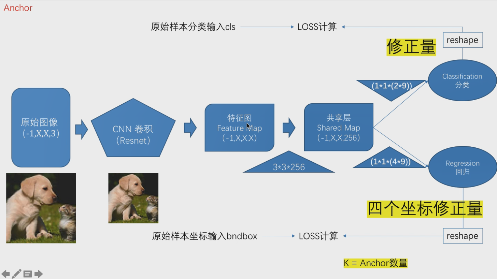

[TOC]

# Class1 Anchor生成

## FasterRCNN 

注：其中`ratio`是长宽比

## np.meshgrid()

参考：https://www.cnblogs.com/black-mamba/p/9186965.html

通过输入的x和y输出(x.shape,y.shape)个数

## np.stack()

参考：https://blog.csdn.net/wgx571859177/article/details/80987459

# Class2 网络的多输入多输出

# Class3 ResNet

# Class4 SharedMap

注：上图`黄底的修正量`改为`分类`

# Class5 物体检测之自有样本标注和读取

